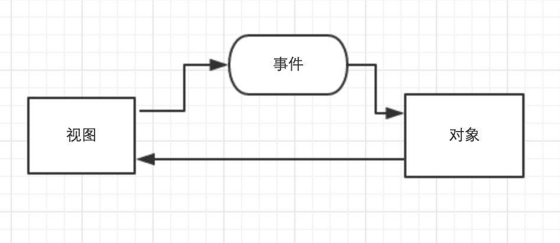

# 事件

数据绑定部分讲了，对象状态发生变化，通知页面更新视图元素的单向数据流向。

一旦用户操作或者数据更新引起数据变化，视图需要同步更新。就需要用到事件传递了。视图上的数据都必须用过事件传递给对象，只有用户操作视图，才能获取到数据，并更新对象状态。调用this.setData（）方法实现视图的部分渲染。



- 视图A由于用户操作，触发事件A 。
- 事件A处理函数中，更新对象A和对象B的状态。
- 由于对象A和B状态变化，通知视图A和B更新。

<br>
<br>

### 事件的使用方式

```html
<!-- index.wxml -->
<view bindtap="changeText" data-hi="wechat" id="tapTest"> {{ message }} </view>
```

```js
index.js:
Page({
 data: {
   message: 'Hello MINA!'
 },
changeText: function(e){
    console.log(e)
    this.setData({
      message:'changed data'
    })
  }
})
```


<br>
<br>

### 事件分类

事件分为冒泡事件和非冒泡事件：

- 冒泡事件：当一个组件上的事件被触发后，该事件会向父节点传递。
- 非冒泡事件：当一个组件上的事件被触发后，该事件不会向父节点传递。

WXML的冒泡事件列表：

类型|触发条件|最低版本
---|---|---
touchstart|手指触摸动作开始| 
touchmove|手指触摸后移动| 
touchcancel|手指触摸动作被打断，如来电提醒，弹窗|
touchend|手指触摸动作结束|
tap|手指触摸后马上离开|
longpress|手指触摸后，超过350ms再离开，如果指定了事件回调函数并触发了这个事件，tap事件将不被触发|1.5.0
longtap|手指触摸后，超过350ms再离开（推荐使用longpress事件代替）|
transitionend|会在 WXSS transition 或 wx.createAnimation 动画结束后触发|
animationstart|会在一个 WXSS animation 动画开始时触发|
animationiteration|会在一个 WXSS animation 一次迭代结束时触发|
animationend|会在一个 WXSS animation 动画完成时触发|
touchforcechange|在支持 3D Touch 的 iPhone 设备，重按时会触发|

<br>
<br>

### 事件绑定与冒泡


事件绑定的写法以 key、value 的形式。
- key 以bind或catch开头，然后跟上事件的类型，如bindtap、catchtouchstart。
- value 是一个字符串，需要在对应的 Page 中定义同名的函数。不然当触发事件的时候会报错。

```js
<view id="outer" bindtap="handleTap1">
  outer view
  <view id="middle" catchtap="handleTap2">
    middle view
    <view id="inner" bindtap="handleTap3">inner view</view>
  </view>
</view>
```

bind事件绑定不会阻止冒泡事件向上冒泡，catch事件绑定可以阻止冒泡事件向上冒泡。


### 事件的捕获阶段

捕获阶段位于冒泡阶段之前，且在捕获阶段中，事件到达节点的顺序与冒泡阶段恰好相反。需要在捕获阶段监听事件时，可以采用capture-bind、capture-catch关键字，后者将中断捕获阶段和取消冒泡阶段。


在下面的代码中，点击 inner view 会先后调用handleTap2、handleTap4、handleTap3、handleTap1。

```html
<view
  id="outer"
  bind:touchstart="handleTap1"
  capture-bind:touchstart="handleTap2"
>
  outer view
  <view
    id="inner"
    bind:touchstart="handleTap3"
    capture-bind:touchstart="handleTap4"
  >
    inner view
  </view>
</view>
```

如果将上面代码中的第一个capture-bind改为capture-catch，将只触发handleTap2。

```html
<view
  id="outer"
  bind:touchstart="handleTap1"
  capture-catch:touchstart="handleTap2"
>
  outer view
  <view
    id="inner"
    bind:touchstart="handleTap3"
    capture-bind:touchstart="handleTap4"
  >
    inner view
  </view>
</view>
```
