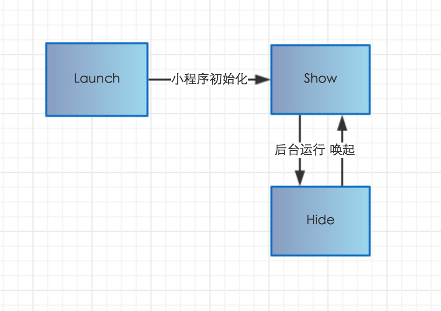
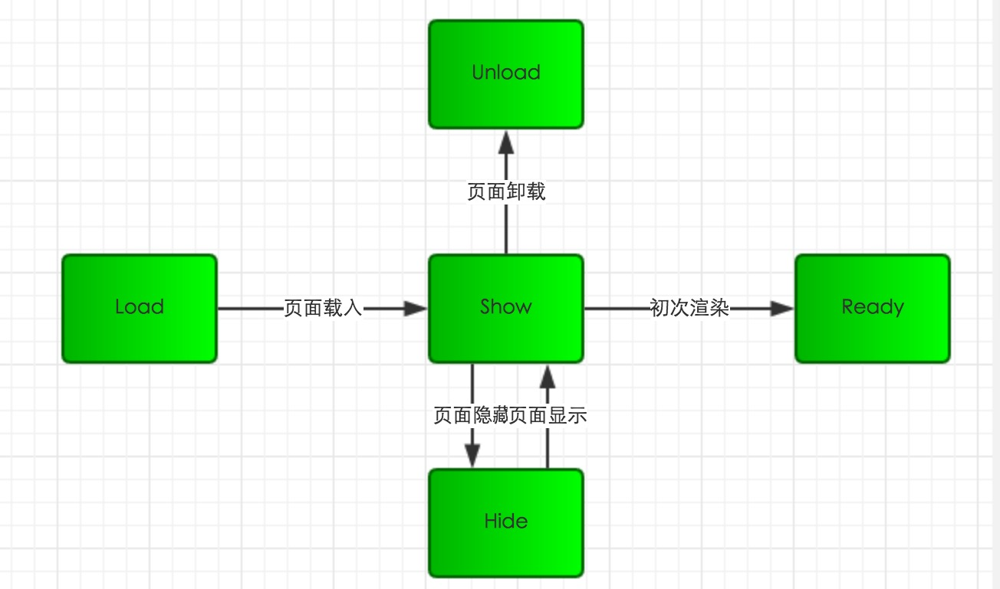

# 生命周期

小程序分为应用、页面和组件三个部分，所以小程序的生命周期涉及以下：

- 应用的生命周期
- 页面的生命周期
- 组件的声明周期
- 应用的生命周期对页面生命周期的影响

### （1）应用的生命周期
`App()` 函数用来注册一个小程序。接受一个 `Object` 参数，其指定小程序的生命周期回调等。<br>
`App()` 必须在 `app.js` 中调用，必须调用且只能调用一次。

```js
App({
  onLaunch: function(options) {
    // 监听小程序初始化。小程序初始化完成时（全局只触发一次）
  },
  onShow: function(options) {
    // 监听小程序显示。小程序启动，或从后台进入前台显示时
  },
  onHide: function() {
    // 监听小程序隐藏。小程序从前台进入后台时。
  },
  onError: function(msg) {
    console.log(msg) // 错误监听函数。小程序发生脚本错误，或者 api 调用失败时触发，会带上错误信息
  },
  onPageNotFound: function(res) {
    // 页面不存在监听函数。小程序要打开的页面不存在时触发，会带上页面信息回调该函数
  },
  globalData: 'I am global data'
})
```
**前台、后台定义**： 当用户点击左上角关闭，或者按了设备 Home 键离开微信，小程序并没有直接销毁，而是进入了后台；当再次进入微信或再次打开小程序，又会从后台进入前台。

> 我们来看图：应用生命周期



1. 用户首次打开小程序，触发 onLaunch 方法（全局只触发一次）。
2. 小程序初始化完成后，触发 onShow 方法，监听小程序显示。
3. 小程序从前台进入后台，触发 onHide 方法。
4. 小程序从后台进入前台显示，触发 onShow 方法。
5. 小程序后台运行一定时间，或系统资源占用过高，会被销毁。

全局的 `getApp()` 函数可以用来获取到小程序 `App` 实例。

```js
// other.js
var appInstance = getApp()
console.log(appInstance.globalData) // I am global data
```

**注意：** 

- 不要在定义于 App() 内的函数中调用 getApp() ，使用 this 就可以拿到 app 实例。
- 通过 getApp() 获取实例之后，不要私自调用生命周期函数。

<br>
<br>


### （2）页面的生命周期

`Page(Object) `函数用来注册一个页面。接受一个 `Object` 类型参数，其指定页面的初始数据、生命周期回调、事件处理函数等。

```js
//index.js
Page({
  data: {
    // 页面的初始数据
    text: "This is page data."
  },
  onLoad: function(options) {
    // 生命周期回调—监听页面加载
  },
  onReady: function() {
    // 生命周期回调—监听页面初次渲染完成
  },
  onShow: function() {
    // 生命周期回调—监听页面显示
  },
  onHide: function() {
    // 生命周期回调—监听页面隐藏
  },
  onUnload: function() {
    // 生命周期回调—监听页面卸载
  },
  onPullDownRefresh: function() {
    // 监听用户下拉动作
  },
  onReachBottom: function() {
    // 页面上拉触底事件的处理函数
  },
  onShareAppMessage: function () {
    // 用户点击右上角转发
  },
  onPageScroll: function() {
    // 页面滚动触发事件的处理函数
  },
  onResize: function() {
    // 页面尺寸改变时触发
  },
  onTabItemTap(item) {
    // 当前是 tab 页时，点击 tab 时触发
    console.log(item.index)
    console.log(item.pagePath)
    console.log(item.text)
  },
  // 任意的函数，在页面的函数中用 this 可以访问
  viewTap: function() {
    this.setData({
      text: 'Set some data for updating view.'
    }, function() {
      // this is setData callback
    })
  },
  // 任意数据，在页面的函数中用 this 可以访问
  customData: {
    hi: 'MINA'
  }
})
```

> 我们来看图：页面生命周期




- 小程序注册完成后，加载页面，触发onLoad方法。
- 页面载入后触发onShow方法，显示页面。
- 首次显示页面，会触发onReady方法，渲染页面元素和样式，一个页面只会调用一次。
- 当小程序后台运行或跳转到其他页面时，触发onHide方法。
- 当小程序有后台进入到前台运行或重新进入页面时，触发onShow方法。
- 当使用重定向方法wx.redirectTo(object)或关闭当前页返回上一页wx.navigateBack()，触发onUnload。

**总结**

- `onLoad`:   页面加载。一个页面只会调用一次。参数可以获取`wx.navigateTo`和`wx.redirectTo`及`<navigator/>`中的 `query`。
- `onShow`:   页面显示。每次打开页面都会调用一次。
- `onReady`:  页面初次渲染完成。一个页面只会调用一次，代表页面已经准备妥当，可以和视图层进行交互。对界面的设置如`wx.setNavigationBarTitle`请在`onReady`之后设置。
- `onHide`:   页面隐藏。当`navigateTo`或底部`tab`切换时调用。
- `onUnload`: 页面卸载。当`redirectTo`或`navigateBack`的时候调用。


 **Page 实例的生命周期**

 > 我们来看图：实例生命周期


小程序由两大线程组成：负责界面的视图线程（view thread）和负责数据、服务处理的服务线程（appservice thread），两者协同工作，完成小程序页面生命周期的调用。

视图线程有四大状态：

1. 初始化状态：初始化视图线程所需要的工作，初始化完成后向 “服务线程”发送初始化完成信号，然后进入等待状态，等待服务线程提供初始化数据。
2. 首次渲染状态：当收到服务线程提供的初始化数据后（json和js中的data数据），渲染小程序界面，渲染完毕后，发送“首次渲染完成信号”给服务线程，并将页面展示给用户。
3. 持续渲染状态：此时界面线程继续一直等待“服务线程”通过this.setdata（）函数发送来的界面数据，只要收到就重新局部渲染，也因此只要更新数据并发送信号，界面就自动更新。
4. 结束状态：页面被回收或者销毁、应用被系统回收、销毁时触发。

服务线程五大状态：

1. 初始化状态：此阶段仅启动服务线程所需的基本功能，比如信号发送模块。系统的初始化工作完毕，就调用自定义的onload和onshow，然后等待视图线程的“初始化完成”。onload是只会首次渲染的时候执行一次，onshow是每次界面切换都会执行。
2. 等待激活状态：接收到“视图线程初始化完成”信号后，将初始化数据发送给“视图线程”，等待视图线程完成初次渲染。
3. 激活状态：收到视图线程发送来的“首次渲染完成”信号后，就进入激活状态既程序的正常运行状态，并调用自定义的onReady()函数。此状态下就可以通过 this.setData 函数发送界面数据给界面线程进行局部渲染，更新页面。
4. 后台运行状态：如果界面进入后台，服务线程就进入后台运行状态，从目前的官方解读来说，这个状态挺奇怪的，和激活状态是相同的，也可以通过setdata函数更新界面的。毕竟小程序的框架刚推出，应该后续会有很大不同吧。
5. 结束状态：页面被回收或者销毁、应用被系统回收、销毁时触发。

> 另： 写过react的童鞋都知道，react 中使用了 will、 did、should 等一系列有时态语义的词汇命名钩子函数。小程序中，统一使用on，那么on是在行为前还是行为后，从实例生命周期图中，我们可以明显看到：钩子触发执行时机都是在事件完成之后触发的。例如 `set to background` 之后 `onHode`。

<br>
<br>

### （3） 组件的生命周期

组件的生命周期，指的是组件自身的一些函数，这些函数在特殊的时间点或遇到一些特殊的框架事件时被自动触发。

其中，最重要的生命周期是 created attached detached ，包含一个组件实例生命流程的最主要时间点。

1. created 组件实例化，但节点树还未导入，因此这时不能用setData
2. attached 组件初始化完毕，节点树完成，可以用setData渲染节点，但无法操作节点
3. ready 组件布局完成，这时可以获取节点信息，也可以操作节点
4. moved 组件实例被移动到树的另一个位置
5. detached 组件实例从节点树中移

组件所在页面的生命周期, 指的是那些并非与组件有很强的关联，但有时组件需要获知，以便组件内部处理的生命周期，在 pageLifetimes 定义段中定义。

1. show 组件所在的页面被展示时执行
2. hide	组件所在的页面被隐藏时执行
3. resize	组件所在的页面尺寸变化时执行


```js
Component({
  lifetimes: {
    created() {
      // 在组件实例刚刚被创建时执行
    },
    attached() {
      // 在组件实例进入页面节点树时执行
    },
    ready() {
      // 在组件在视图层布局完成后执行
    },
    moved() {
      // 	在组件实例被移动到节点树另一个位置时执行
    },
    detached() {
      // 在组件实例被从页面节点树移除时执行
    },
    error(err) {
      // 每当组件方法抛出错误时执行
    }
  },

  pageLifetimes: {
    show() {
      // 页面被展示
    },
    hide() {
      // 页面被隐藏
    },
    resize(size) {
      // 页面尺寸变化
    }
  },

  // 以下是旧式的定义方式，可以保持对 <2.2.3 版本基础库的兼容
  attached() {
    // 在组件实例进入页面节点树时执行
  },
  detached() {
    // 在组件实例被从页面节点树移除时执行
  },
  // ...
})
```

<br>
<br>

### （4）应用的生命周期对页面生命周期的影响

 > 我们来看图：应用生命周期影响页面生命周期


1. 小程序初始化完成后，页面首次加载触发onLoad，只会触发一次。
2. 当小程序进入到后台，先执行页面onHide方法再执行应用onHide方法。
3. 当小程序从后台进入到前台，先执行应用onShow方法再执行页面onShow方法。


```
app onLaunch
app onShow

component created
component attached

page onLoad {id: "test"}

component show

page onShow

component ready

page onReady
page onUnload

component detached

app onHide

```


参考文档
----------
- [玩转Page组件的生命周期](https://www.cnblogs.com/ihardcoder/p/6136748.html)
- [微信小程序之生命周期（四）](https://www.jianshu.com/p/0078507e14d3)
- [微信小程序之生命周期(三)](https://www.cnblogs.com/nosqlcoco/p/wxsmallcycle.html)
